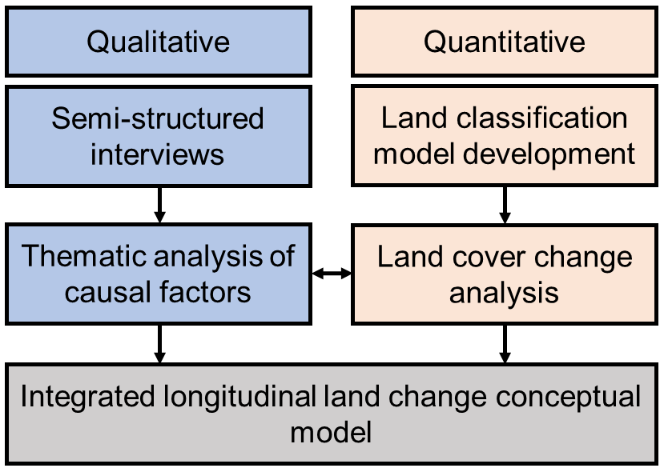
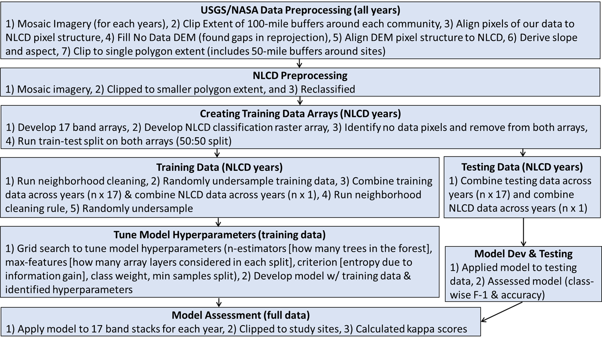

# Random-plains-class: Introducing a repo used to analyze land change in northeastern Colorado from 1984 to 2019

   
  <b>Jake Bobula</b> 
  <b>April 5, 2021</b>  
   

### Random-plains-class
Our random-plains-class repo found [here](https://github.com/jakebobu/random-plains-class) contains the scripts to create a random forest land classification model. Our research team used this repo to analyze 36 years of satellite imagery to investigate land cover trends. This repo serves two purposes: 1) as the aggregation of scripts to reproduce the data found in our research article "A social-ecological land-use change model: A multi-method examination of change on working rangelands in northeastern Colorado from 1984 to 2019" and 2) as a contribution to and inspiration for connecting geospatial, satellite imagery, and machine learning open source libraries. I designed this repo to examine land cover change in northeastern Colorado within a more extensive research study that I discuss below. Thus, this is not a coherent library but one approach to building a land classification model that met our collaborative team's research needs. Lastly, this repo is a work in progress, so please follow and fork.

### Our multi-method land change research study
Northeastern (NE) Colorado cattle ranchers identify rapid social and ecological change as a threat to rangeland ecosystems and their natural resource-dependent communities. Thus, our interdisciplinary team conducted a multi-method research study, integrating qualitative and quantitative data, to examine the causes and consequences of land-use change on land cover in two ranching communities in Larimer and Weld Counties, Colorado.

 

The multi-method research process we used to examine the causes and consequences of change in northeastern Colorado.  

I developed and applied the random-plains-class repo to analyze land cover changes for the two study sites (i.e., the study's quantitative component). Our development and use of the repo enabled us to extend our longitudinal analysis beyond that of the commonly used NLCD data, which offers seven years of data from 2001-2016. Thus, we matched the qualitative and quantitative data's temporal and geographic extents, enabling us to perform an integrated analysis. In our integrated analysis, we used these quantitative data to examine land cover changes while working with ranchers to identify the causes of our land cover findings. The availability of public satellite data and open source libraries makes such longitudinal and multi-method studies increasingly possible.

 
Our two study sites, one centered in northeastern Larimer County and the other in northcentral Weld County, Colorado.

One of our findings is that both study sites experienced a decline in cultivated cropland from 1984-2019, with 16.0% and 18.7% of total land areas transitioning out of cultivated cover in the Larimer and Weld sites, respectively. Most cultivated land transitioned to herbaceous/grassland cover, with 10.3% and 18.4% of total land area transitioning to grassland cover from 1984-2019 in Larimer and Weld. Our findings differ from national-level land cover trends (i.e., increased cropland and decreased grassland cover). In discussions with local ranchers, our qualitative team identified the role of local conservation policies in mitigating grassland conversion at our study scale.

 
Land cover change in our two study sites: 1984 and 2019 model outputs showing the change in cultivated crop cover (yellow).

I designed this repo to collaboratively address an applied research question in northeastern Colorado. Yet, others can use the repo to replicate this process with minor adaptations in locations with NLCD coverage, such as Arizona's Sonoran Desert or Tennessee's Great Smokey Mountains. Moreover, this repo provides an illustrative model of the integration of diverse geospatial libraries in python/bash. I built this repo by drawing [inspiration](http://devseed.com/sat-ml-training/Randomforest_cropmapping-with_GEE) and [elements](https://georasters.readthedocs.io/en/latest/) from [other](https://imbalanced-learn.org/stable/references/generated/imblearn.under_sampling.NeighbourhoodCleaningRule.html) [public](https://emapr.github.io/LT-GEE/api.html#buildsrcollection) [resources](https://opensourceoptions.com/blog/python-geographic-object-based-image-analysis-geobia/), so please adapt and share. Our research team is already starting to modify this repo to train against new classification systems in East Africa's rangelands. Check back for updates on our next adventure in East Africa!

 
Satellite imagery inputs

 
Flow chart of the development of the land classification model included in the repro

 
Performance metrics of the land classification model included in the repro
